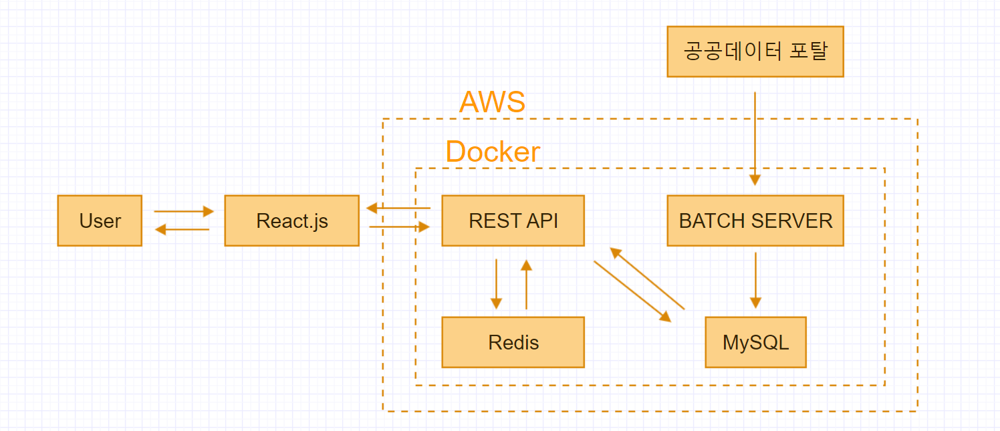
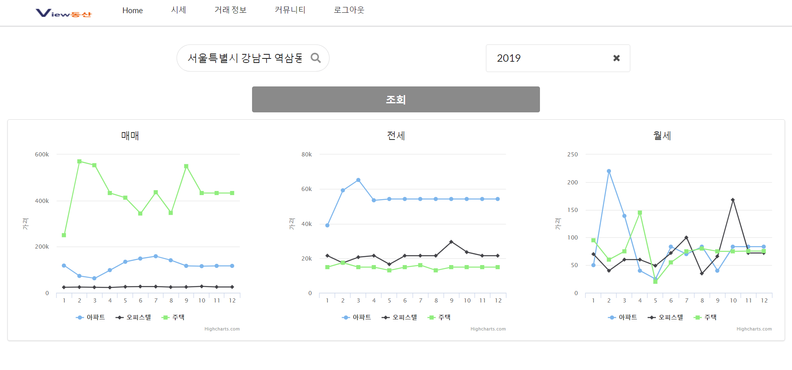
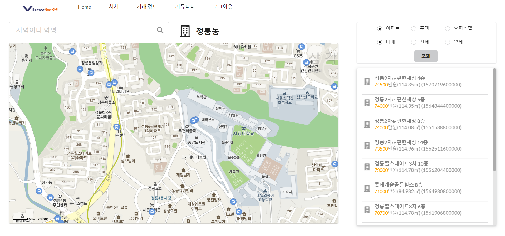
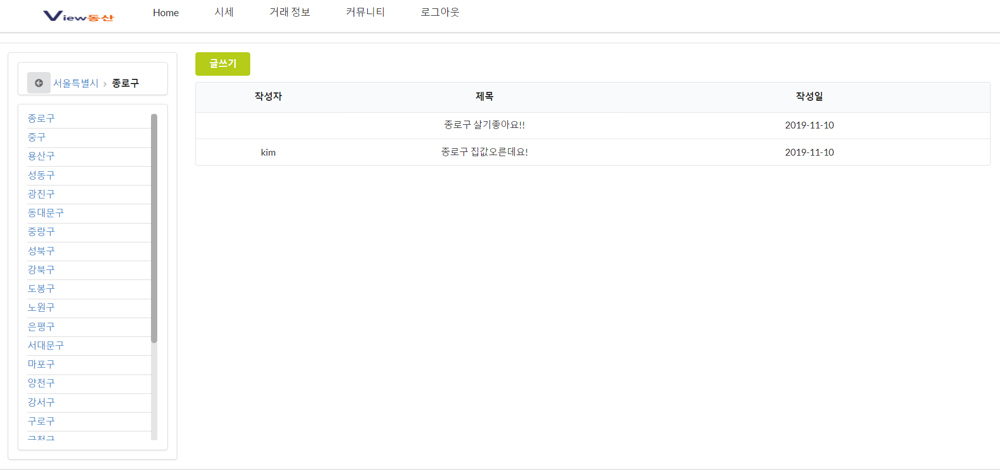

# View동산

## 부동산 시세 변동 확인 & 지역 커뮤니티 서비스

### 서비스 개요
원하는 지역의 부동산 시세 변동을 확인하고 지역별 커뮤니티를 활용하여 정보를 공유하는 웹 페이지 입니다.

## 시스템 구성도

## 실행 화면

## 구현 사항

### Back end

#### spring batch
1. 모든 지역의 매매, 전세, 월세 데이터를 가져오기 위해 파티셔닝 기능 구현
2. 비지니스 로직을 통해 데이터 가공
3. JPA를 사용하여 Database에 저장
4. 월별 데이터를 가져오기 위해 스케쥴링 기능 구현
5. github : <https://github.com/KimYunsang-v/realestate_batch>

#### spring boot (REST API)
1. JPA를 사용하여 영속성 관리와 DB 테이블 객체화
2. QueryDSL로 쿼리를 메소드화 하고 런타임에 발생 할 수 있는 에러 컴파일시 처리
3. 주소를 지역코드로 변경하기 위해 In-memory 방식의 Redis를 사용하여 속도 향상
4. AOP 기능을 사용하여 custom exception 구현
5. Spring security + jwt로 로그인시 토큰을 발행하고 리퀘스트 요청 시 토큰 확인하여 사용자 인증 -> 보안 강화
6. Swagger를 사용하여 API 문서 자동화
7. github : <https://github.com/KimYunsang-v/realestate-server>

#### AWS & Docker
1. AWS EC2서버에 Docker를 사용하여 API server, MySQL, redis 컨테이너 운영
2. API Server github와 Dockerhub를 연동하여 github 트리거 발생 시 docker image 빌드 자동화 
3. docker repositoy : <https://hub.docker.com/repository/docker/qwdbstkd123/realestate>

### Front end

#### React.js
1. 컴포넌트 단위 화면 구성
2. Semantic-ui를 사용하여 엘리먼트 구성
3. github : <https://github.com/KimYunsang-v/realestate_front>

